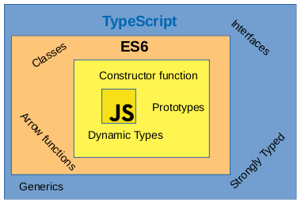

title: Typescript Advanced
class: animation-fade
layout: true

<!-- This slide will serve as the base layout for all your slides -->
.bottom-bar[
  {{title}}
]

---

class: impact

# {{title}}
## Presentation

---

# What is TypeScript

.col-6.space-right[
TypeScript is a superset of JavaScript which primarily provides strongly typing, classes, interfaces...

One of the big benefits is to enable IDEs to provide a richer environment for spotting common errors as you type the code.
]
.contain[

]

---

# How TypeScript works

Common browsers only knows Javascript, then you need to transpile your TS files to JS.

In Node.js ecosystem there are tools to run TypeScript directly like `ts-node`.

If there are any error, TypeScript will throw it in transpiling time.

Most IDEs show errors when writing, so you earn a lot of time and you are more productive.

TypeScript has a [playground](https://www.typescriptlang.org/play/index.html) where you could try it online.

> There is no pure TypeScript code, it is Javascript + extra features.

---

# Work with TypeScript

.col-6[
## Install

```bash
$ yarn add -D typescript
```
]

--

.col-6[
## Initialize

```bash
$ yarn tsc --init
```

This will create a `tsconfig.json` with a default configuration to run TypeScript in your project
]

--

## Compile

.col-5[
```bash
$ yarn tsc
```
]

.col-2[
OR
]

.col-5[
```bash
$ yarn tsc file.ts
```
]

---

# Implicit/Explicit types

Types could be implicit or explicit.

.col-6[
Implicit type:

```typescript
let name = 'MyName';
```

]

.col-6[
Explicit type:

```typescript
let name: string;
name = 'MyName';
```

]

If no type is inferred, typescript will assume that is `any`

---

# Types

.col-6[
## Basic types

- boolean
- number
- string
- void `(function without return)`
- null/undefined/never
- any
- array
- tuples `(array different types)`
- object
- enum

]

--

.col-6[
## Advanced types

- Custom types `(class or interface)`
- Union `(number | string)`
- Intersection `(Person & Loggable)`
- Type aliases `(type numString = number | string)`
- Function as types

]

---


